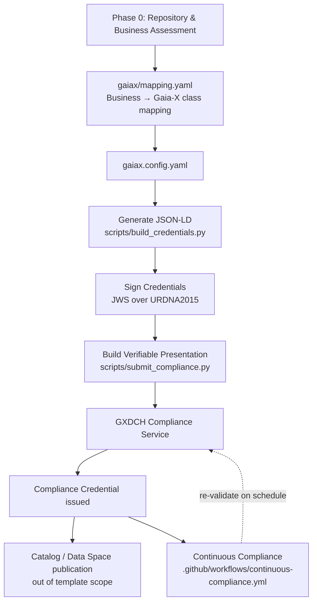

# gaiax-compliance-template


**An open-source starter kit for turning Gaia-X compliance requirements into a practical, repeatable implementation.**

If you've ever looked at the Gaia-X documentation and thought *"okay, but what do I actually build?"* — that's what this repo is for.

It takes you from a plain-language business assessment → Gaia-X ontology mapping → JSON-LD → signing → GXDCH submission, with examples for serving the resulting metadata from your own infrastructure.

> **Community project — not affiliated with or endorsed by Gaia-X AISBL.**  
> This repository is an independent implementation of publicly available Gaia-X specifications.

## What you get

- 📋 **Phase 0 assessment** — answer the important business questions before touching configuration
- 🧩 **Information Model mapping** — explicitly map business objects to Gaia-X ontology classes
- 🔐 **Real JSON-LD signing** — URDNA2015 normalization and detached JWS
- ✅ **Evidence-based policies** — claims are expected to point to something verifiable
- 🔁 **Continuous compliance** — scheduled checks catch configuration and credential drift
- 🧱 **Framework-agnostic examples** — FastAPI, Flask and Express

## Gaia-X alignment

The implementation is designed around the Gaia-X compliance and Self-Description model, including Participants, Service Offerings, Resources, Verifiable Credentials and GXDCH-based compliance validation.

**Current specification target:** Gaia-X Compliance Document **3.1.0** / Architecture Document **3.1**.

Gaia-X specifications evolve, so always verify the current requirements before using this repository for production compliance.

## Architecture

The important idea is that **business decisions happen before configuration** and the resulting credentials are continuously re-validated.



**The private key never crosses the trust boundary.** GXDCH and consumers receive signed public documents; they do not receive anything that can be used to sign as you.

More detail: [`docs/ARCHITECTURE.md`](docs/ARCHITECTURE.md)

## 60-second map

```text
docs/PHASE_0_ASSESSMENT.md   → start here
docs/templates/              → business inventory templates
gaiax/mapping.yaml           → business → Gaia-X ontology mapping
gaiax.config.yaml            → configuration source of truth
scripts/                     → keys → DID → LRN → credentials → compliance
api/                         → FastAPI / Flask / Express examples
.github/workflows/           → PR checks + continuous compliance
docs/                        → architecture, FAQ and walkthrough
```

## Quickstart

```bash
pip install -r requirements.txt
```

| # | Command | What it does |
|---|---|---|
| 1 | Fill `docs/templates/*.md` | Capture the business and compliance inputs |
| 2 | Fill `gaiax/mapping.yaml` + `gaiax.config.yaml` | Map those inputs into the Gaia-X model |
| 3 | `python scripts/validate_local.py` | Validate the local configuration |
| 4 | `python scripts/generate_keys.py && python scripts/generate_did.py` | Create the signing identity |
| 5 | `python scripts/request_lrn.py` | Request/notarize the legal registration number |
| 6 | `python scripts/build_credentials.py` | Build and sign the credentials |
| 7 | `python scripts/submit_compliance.py` | Submit to the configured GXDCH Compliance Service |
| 8 | Mount an API example | Serve the resulting metadata |

Full walkthrough: [`docs/HOW_TO_USE_THIS_REPO.md`](docs/HOW_TO_USE_THIS_REPO.md)

## Current status

Local generation, signing and validation are tested end-to-end.

GXDCH staging round-trips have also been tested, including a real-world URL encoding issue with the LRN `vcid` parameter that is now handled by `scripts/request_lrn.py`.

This project is still a **community preview**. If something behaves differently against a live Gaia-X service, please open an issue with the specification/version and endpoint involved.

## Why it's built this way

| Principle | In practice |
|---|---|
| Business before config | Phase 0 forces the important decisions first |
| Config-driven | Business changes live in YAML, not scattered Python |
| Claims need evidence | Unsupported claims should fail validation |
| Static claims stay honest | Policy claims can be checked against live data |
| Staging first | Production actions require an explicit switch |
| Compliance is ongoing | Scheduled CI checks for drift |

## Contributing

Issues and PRs are welcome — especially:

- GXDCH submission reports
- Gaia-X specification/version updates
- schema or ontology changes
- validation improvements
- additional framework examples
- real-world implementation feedback

If you're implementing Gaia-X compliance yourself, **your feedback is particularly useful**: the goal is to turn this from *"works for us"* into something the wider community can review and improve.

## License

MIT — use it for commercial or non-commercial projects.
