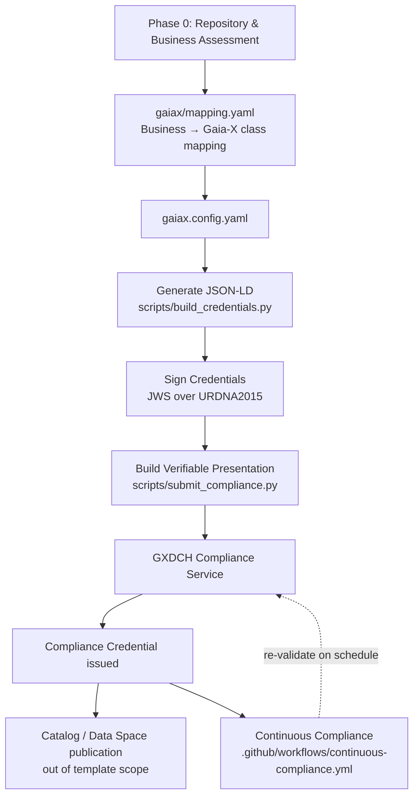
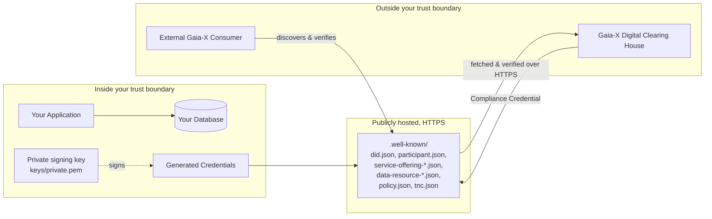

# Architecture

## Revised flow (v2)

This replaces v1's flat `config → templates → scripts → compliance` chain.
The additions: an explicit business-assessment step before any config is
touched, an explicit mapping artifact between business concepts and Gaia-X
ontology classes, and a feedback loop back into the Compliance Service
instead of treating compliance as a one-time event.

## Trust boundary

The one thing worth internalizing from this diagram: **your private key
never crosses the boundary**. The GXDCH and any consumer only ever see
signed, public documents — they verify your signature against your
published public key, they never receive anything that could let them sign
as you. If a script in this repo ever asks you to upload or paste
`private.pem` somewhere, that's not how this is supposed to work.

## Why one Service Offering (usually)

`docs/templates/service_inventory.md` pushes you toward one external
Service Offering per project, with internal steps folded into its
description rather than published separately. This mirrors how Gaia-X
catalogs are meant to be browsed: a consumer searching for "agricultural
image processing" shouldn't have to separately discover and stitch
together "orthophoto generation" + "object detection" + "plant counting" as
three unrelated offerings from the same provider. Split only when different
customers genuinely consume different pieces independently.
